# Lab 2 PROC-1

## Task 1 – Programs and Processes

### Subtask 1.1 - Process Basics

**Using “top”, explain the elements of the “Summary Display”**

>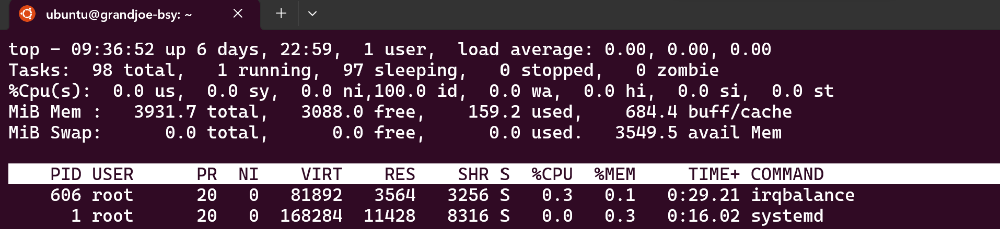
> 
> Up time, user sessions, CPU usage, Memory usage, etc. 

**Which process has PID 1 and PID 2? Who is the owner of these processes?**
> **PID1**: Systemd (root):
>
> **PID2**: kthreadd (root):

**What is the PID of your terminal? Who is the owner?**
>`ps aux | grep bash` 
> 
> 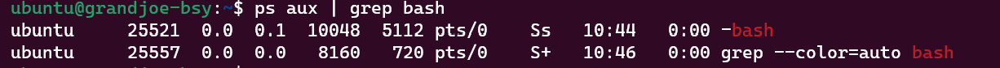

**Show the Environmental Variables of your terminal. Add a variable named Name and assign your surname to it.**
> show: `env`
> 
> new env variable: `export NAME=Grand`

**Study the “tail” program and find out how to monitor the evolution of a file in real-time. Use this tool to monitor system information available in the following file: /var/log/syslog. Start a second terminal and observe the output of your monitoring session. What do you notice?**
> `tail -f /var/log/syslog`
> 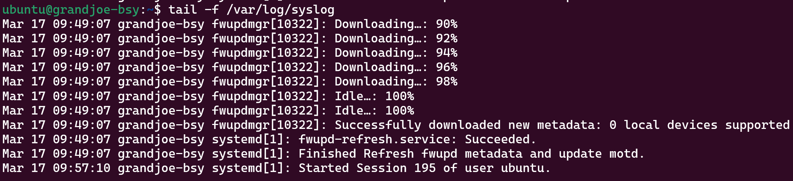

**On the second terminal, what is the PID and the state of your monitoring process (tail)?**
> `ps aux | grep tail`
> 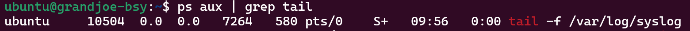 (PID: 10504)

**Show the process hierarchy of your observer process (tail)**
> `pstree -p`
> 
> 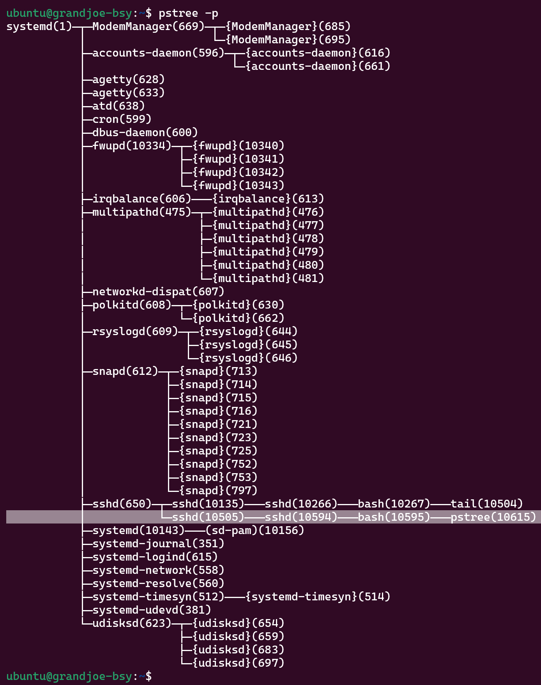 

**Terminal (kill) the terminal that runs the tail command and explain what happens.**
> The parent processes "bash" and "sshd" get killed:
>
> The "tail" process is still running as an orphan and gets assigned the init process as new parent. It will clean up the now unnecessary "tail" process and send a sigterm.
>
> If we run "ps -aux | grep tail" we dont see the "tail -f" command:
>
> 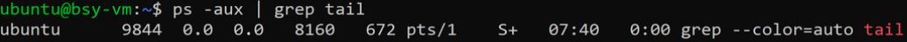 

### Subtask 1.2 – Job Control

**Study the “Job Control” section of the bash man page. Start three observer processes and put all of
them into the background. Display the list of background jobs and explain the output.
Move job number 2 into foreground and press Ctrl + z. List again the job list. What is the difference
now?**

>`vim /etc/temp/1 &` 
> use **&** for starting the process in the background
> 
> 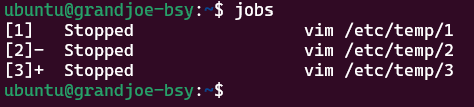
> 
> `fg %2` put process 2 in the foreground
> `Ctrl + Z` to pause it again
> 
> 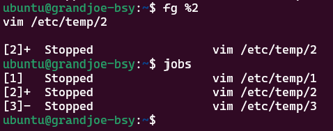
> 
> Last post job marked with **+**
> 
> Immidiate post job marked with **-**

### Subtask 1.3 – Process Creation
> [HelloWorld.c](./code/HelloWorld.c)

**Revisit the layout of a binary and print the sizes of sections “Text”, “Data” and “BSS”. What is the
difference between the “Berkley” and the “Gnu” format?**
> `size HelloWorld --format=berkeley` oder `size HelloWorld --format=sysv`
> 
> 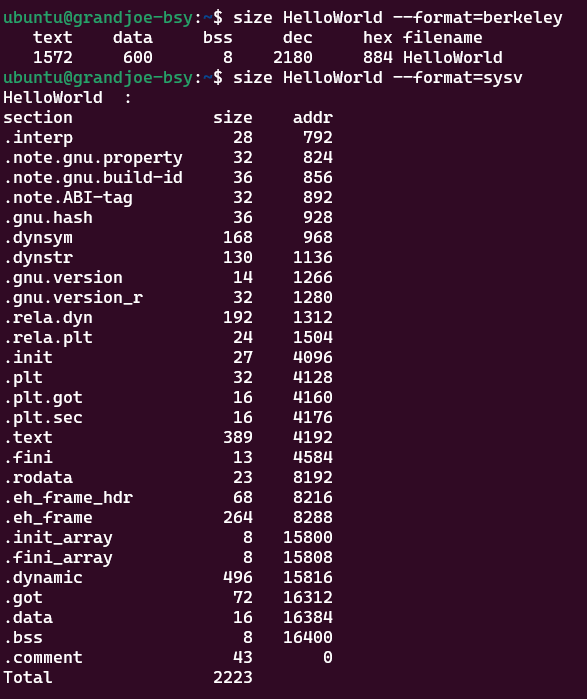
> 
> GNU lists every section 

**Use objdump and display all section headers. Revisit the sections above and study the elements of
each section. Disassemble the “Text” section.**
> objdump -h HelloWorld
> 
> 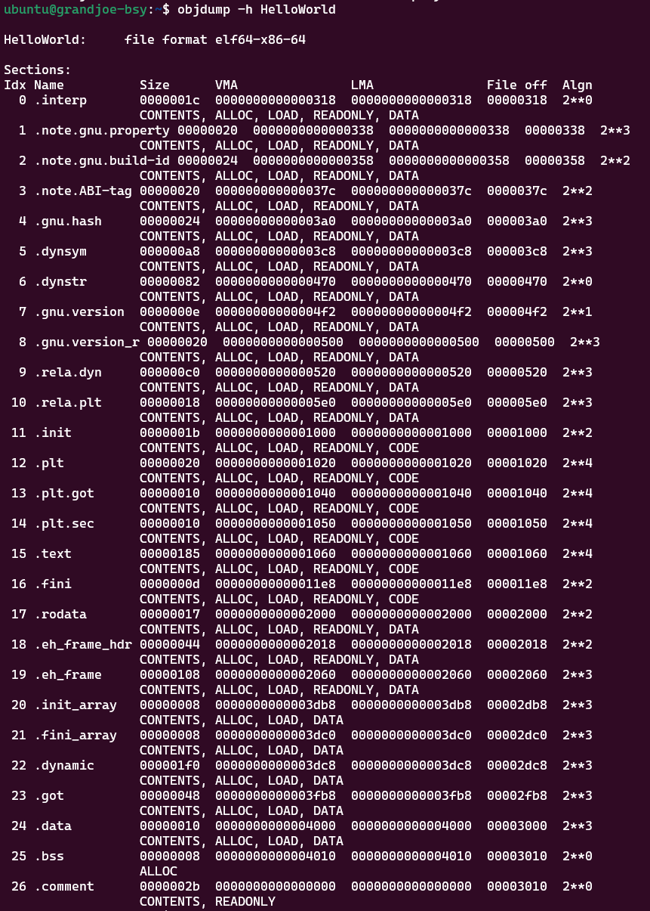

**Write a program that when running as a process, creates another process by “forking” (man fork)
itself. Use the library function “sleep()” (man sleep) to put both processes to sleep for 30 seconds
before they terminate. Check the memory usage of both processes and explain. You may find
“getpid()” useful, see man getpid.**
> [fork.c](./code/fork.c)
> 
> 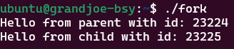
> 
> `ps aux | grep fork` to see the memory usage:
> 
> 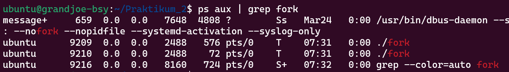
> 
> Note that the second process (child process) uses only 72kb instead of 576kb as the **Copy-On-Write** mode is used (default).

### Subtask 1.4 – Zombie
> [Zombie.c](./code/Zombie.c)
> 
> 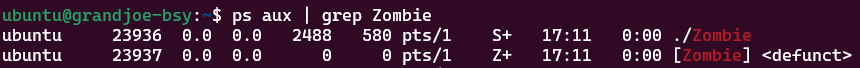 Zombie-process marked with **<defunc>**

### Subtask 1.5 – Zombie or no Zombie
> [Orphan.c](./code/Orphan.c)
> 
> 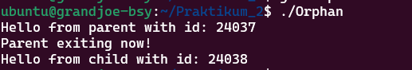
> 
> 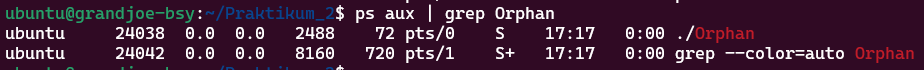
> 
> Note that only the child process is shown. When you look at the hierarchy you see the new parent of the oprhan:
> 
> 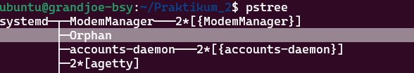

## Task 2 – Multi-Threading
> * if less than 2 args, stop
> * create stack with following features:
>   * `NULL`: anywhere you want
>   * `STACK_SIZE`: the size
>   * `PROT_READ |PROT_WRITE`: read / write access permitted
>   * `MAP_PRIVATE | MAP_ANONYMOUS | MAP_STACK`: only seen by this process, mapping to heap, allocate mapping at a suitable address for process / thread
>   * `-1`: file descriptor (-1 = none)
>   * `0`: offset
> * clone() creates child that will start his execution in childFunc entry point and top of stack is passed to child
> * parent waits for the child to finish
>
> **How can you (developer) define what should be shared between parent and child?**
>  
> Within the clone function the developer can define what can be shared -> here stack. 
  
## Task 3 - Kernel Threads
> `top` PID 2 is used by kthreadd

**Identify Kernel threads:**
> `ps -efH`
> 
> All processes which are within []

**See on which cpu a thread is running**
> In the file /proc/<PID>/stat the 39 variable shows the cpu id the thread / program is running on:
> 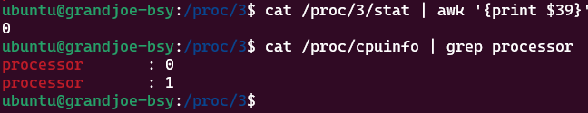

**Select any thread called “Kworker” and explain the state by querying it with the ps command.**
>
> 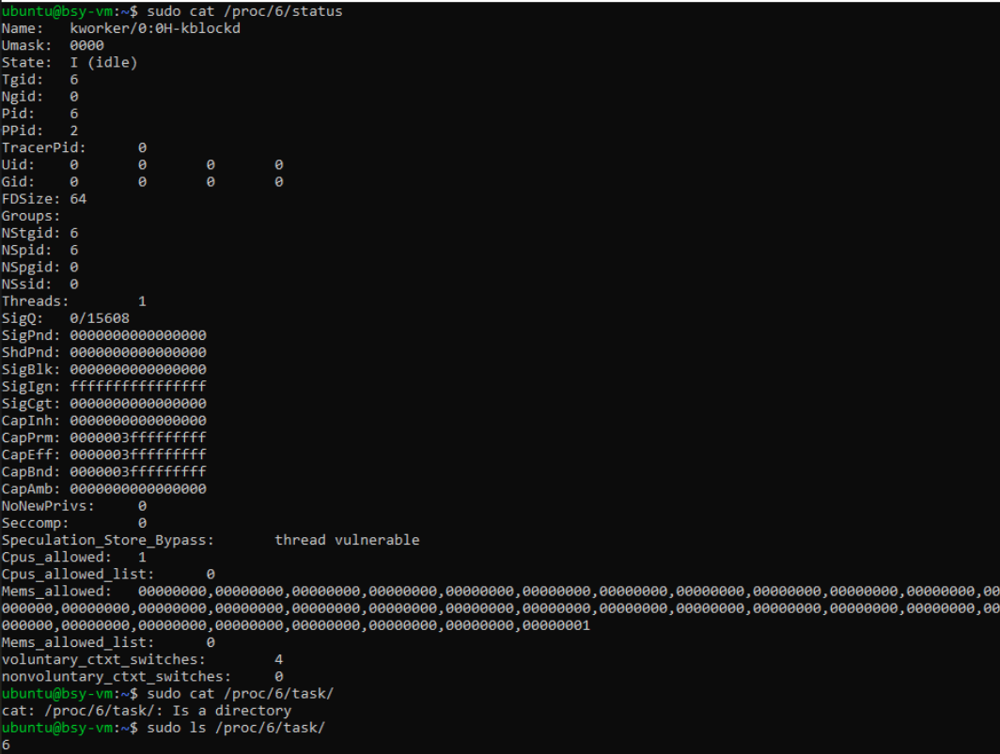
>
> 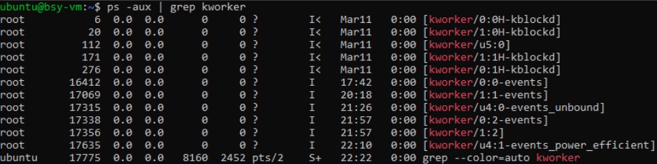
>
>We can see that the coworker process here is "IDLE". This can also be seen at "I" in "ps". On the other hand we see its name, where it may be written to, in which address, on which CPU it may run, on which CPUs it may be scheduled (cpus_allowed), how many threads there are (1) also seen in proc/6/task (number of entries = number of tasks), who the parent is (ppid)...
